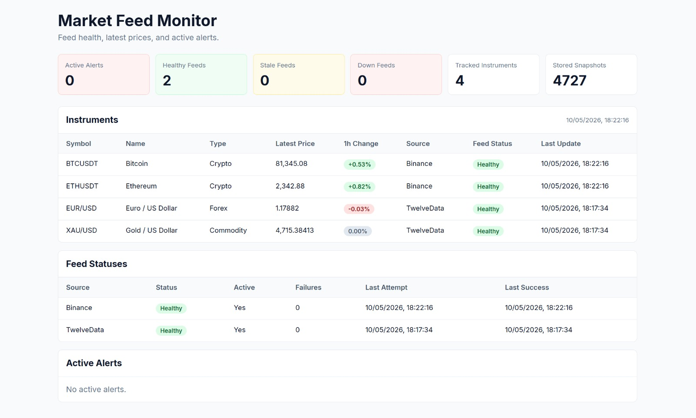

# Market Feed Monitor

Market Feed Monitor is a small internal-tool-style application for collecting market data from a limited number of sources, storing periodic snapshots, monitoring feed health, and surfacing simple alerts in a lightweight dashboard.

The MVP is intentionally narrow. The goal is to build a clean end-to-end system that shows the full flow from ingestion to visibility, not to build a broad trading platform.

## Dashboard Preview



## MVP Scope

The first version is limited to:

- 2 market data sources
- 4 instruments
- periodic snapshot collection and storage
- basic feed health monitoring
- 2-3 simple alert types
- a lightweight dashboard for status, recent snapshots, and active alerts

## Confirmed Data Scope

The MVP uses these sources and polling intervals:

- Binance, polled every 15 seconds
- Twelve Data, polled every 5 minutes

The initial instrument list is fixed to:

- BTCUSDT
- ETHUSDT
- EUR/USD
- XAU/USD

## Confirmed Stack

- Backend: ASP.NET Core Web API
- Frontend: React + TypeScript + Vite
- Database: PostgreSQL
- ORM: Entity Framework Core
- Python: optional later, only after the core .NET application is working

The system should demonstrate this core flow:

`ingest -> store snapshots -> evaluate feed health -> trigger alerts -> display status`

## How to Run Locally

### 1. Start PostgreSQL

```powershell
docker compose up -d
```

PostgreSQL is exposed on port `5433`.

### 2. Configure Twelve Data API Key

The Twelve Data API key is stored locally with .NET user secrets:

```powershell
dotnet user-secrets set "MarketData:Sources:TwelveData:ApiKey" "YOUR_API_KEY" --project MarketFeedMonitor/MarketFeedMonitor.Api
```

### 3. Start the Backend

```powershell
cd MarketFeedMonitor/MarketFeedMonitor.Api
dotnet run
```

The backend runs on:

```text
http://localhost:5071
```

### 4. Start the Frontend

```powershell
cd frontend
npm.cmd install
npm.cmd run dev
```

The frontend runs on:

```text
http://localhost:5173
```

## Dashboard

The dashboard uses these backend endpoints:

- `GET /api/market-data/feed-summary`
- `GET /api/market-data/feed-statuses`
- `GET /api/market-data/latest-snapshots`
- `GET /api/market-data/active-alerts`

Dashboard data refreshes automatically every 15 seconds. It shows latest prices, feed health, active alerts, and 1h price change calculated from stored snapshots. If there is not enough snapshot history yet, the 1h change is shown as a collecting state.

## Useful Checks

```powershell
dotnet build MarketFeedMonitor/MarketFeedMonitor.sln
cd frontend
npm.cmd run lint
npm.cmd run build
```

## Out of Scope

To keep the MVP focused, the following are explicitly out of scope:

- more than 2 data sources in the first version
- more than 4 instruments in the first version
- broad instrument coverage or large-scale historical datasets
- advanced analytics, forecasting, or trading logic
- user accounts, roles, or multi-tenant support
- complex notification pipelines or alert routing
- production-grade scaling, high availability, or infrastructure hardening
- Python components before the core .NET application is working
